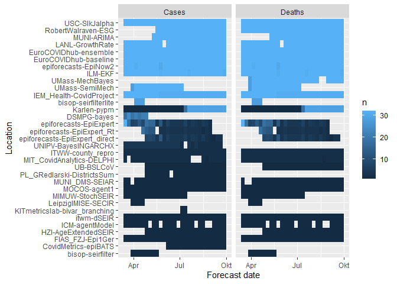
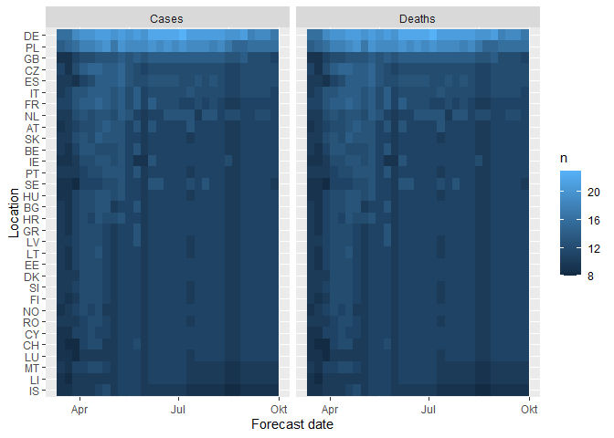
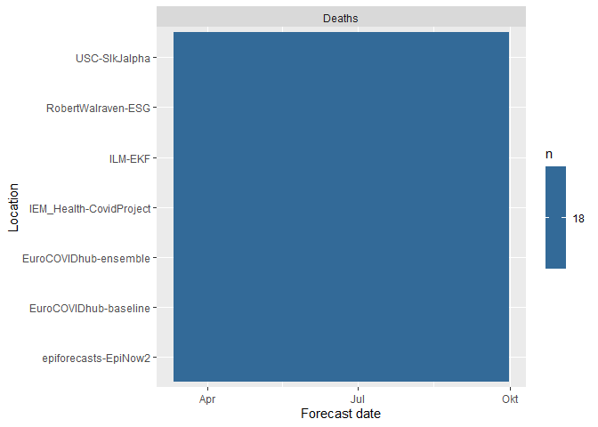
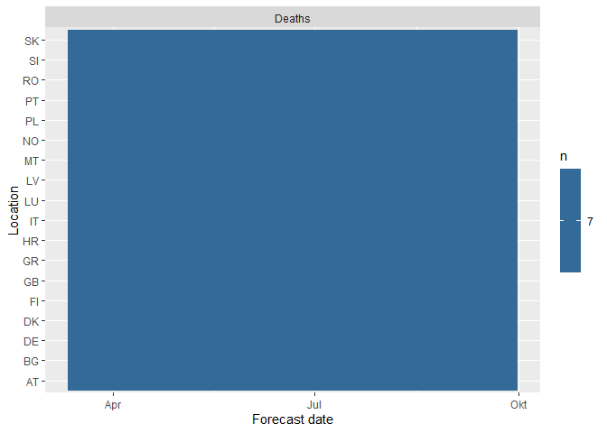
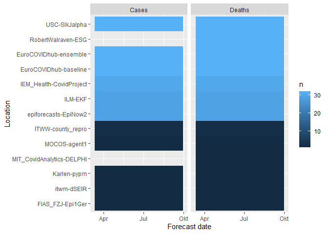
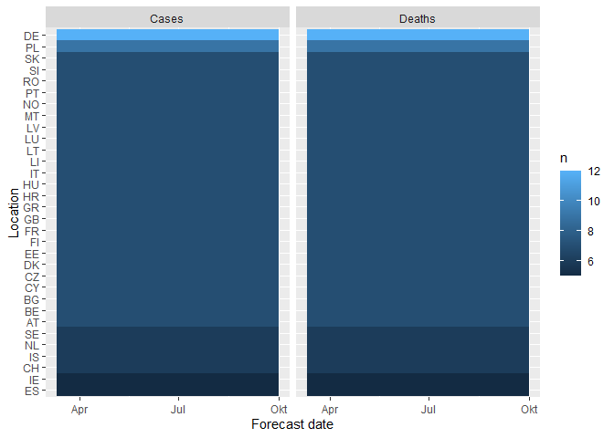

Analysing ensembles to improve forecast performance
================

``` r
library(dplyr)
```

    ## 
    ## Attaching package: 'dplyr'

    ## The following objects are masked from 'package:stats':
    ## 
    ##     filter, lag

    ## The following objects are masked from 'package:base':
    ## 
    ##     intersect, setdiff, setequal, union

``` r
library(here)
```

    ## here() starts at /mnt/data/github-synced/ensembles

``` r
library(stringr)
library(data.table)
```

    ## 
    ## Attaching package: 'data.table'

    ## The following objects are masked from 'package:dplyr':
    ## 
    ##     between, first, last

``` r
library(scoringutils)
```

    ## Note: The definition of the weighted interval score has slightly changed in version 0.1.5. If you want to use the old definition, use the argument `count_median_twice = TRUE` in the function `eval_forecasts()`

``` r
library(purrr)
```

    ## 
    ## Attaching package: 'purrr'

    ## The following object is masked from 'package:scoringutils':
    ## 
    ##     update_list

    ## The following object is masked from 'package:data.table':
    ## 
    ##     transpose

``` r
library(tidyr)
library(ggplot2)
```

Model ensembles usually outperform individual models and forecasters in
terms of predictive performance and therefore play an important role in
any applied forecasting setting (e.g. epidemiology, finance, weather
forecasting). Learned ensembles that adjust ensemble weights based on
past performance hold great potential, but empirically it has proven
surprisingly difficult to improve on simple mean or median ensembles. An
important question therefore is what form of ensemble to choose.

Often, researchers have to decide on what kind of ensemble to use and
can only know much later whether their choice was good. This research
project aims to investigate model ensembles in an epidemiological
setting and tries to establish heuristics for when to use which ensemble
type.

## (Possible) Objectives

-   Analyse the performance of different ensemble techniques
-   Specifically, analyse performance depending on different factors
    like
    -   the number of available forecasting models
        -   the degree of similarity between available forecasting
            models
        -   the available training data
-   Analyse how much do individual models contribute to an ensemble. Can
    a model be a valuable contribution to an ensemble, even though it is
    not a good forecasting model if looked at in isolation?
-   Identify situations in which adding a model is beneficial or not
-   Analyse how stable forecast performance of different ensemble types
    is

## Data

All forecasts are made in a quantile-based format, meaning that
forecasters provide a predictive distribution in the form of 23
quantiles (11 prediction intervals plus the median prediction),
specifying how likely they think the true observed value will fall in a
given range.

### Human forecasts of COVID-19 made in the UK COVID-19 Forceasting Challenge

This data includes all forecasts as well as the true observations.

``` r
uk_data <- fread("data/full-data-uk-challenge.csv")
```

The data has the following columns:

| Column name     | Column prediction                                                           |
|-----------------|-----------------------------------------------------------------------------|
| location_name   | Name of the country                                                         |
| target_end_date | Date for which a forecast was made. This is always a Saturday               |
| target_type     | The target variable to be predicted, cases or deaths                        |
| true_value      | The corresponding true observed value                                       |
| population      | population of the target country                                            |
| forecast_date   | Date on which a forecast was made. This is always a Monday                  |
| quantile        | quantile-level of the predictive distribution                               |
| prediction      | Predicted value corresponding to the quantile-level specified in ‘quantile’ |
| model           | Name of the forecaster                                                      |
| target          | Summary of the prediction target variable (redundant information)           |
| horizon         | Forecast horizon                                                            |
| expert          | Whether or not a forecaster self-identified as an expert                    |

Potential difficulties are:

-   there only is one location
-   there are not a lot of observations
-   many forecasters only submitted a few times and drop in and out

However, it is of particular interest to know

-   how well different ensembles work in difficult settings where
    forecasters drop in and out
-   whether aggregating human forecasts is different from aggregating
    model-based forecasts

### Forecasts submitted to the European Forecast Hub

These forecasts were submitted to the [European Forecast
Hub](https://github.com/epiforecasts/covid19-forecast-hub-europe) by
different research institutions. The file contains forecasts as well as
true observations.

``` r
hub_data <- rbindlist(
  list(
    fread("data/full-data-european-forecast-hub-1.csv"), 
    fread("data/full-data-european-forecast-hub-2.csv")
  )
)
```

Optionally, the Hub data can be filtered to obtain a complete set of
forecasts, as the current data set has missing forecasts:

``` r
# helper functions for visualisation
plot_models_per_loc <- function(data) {
  data |>
    group_by(location, forecast_date) |>
    mutate(n = length(unique(model))) |>
    ggplot(aes(y = reorder(location, n), x = as.Date(forecast_date), fill = n)) + 
    geom_tile() + 
    facet_wrap(~ target_type) + 
    labs(y = "Location", x = "Forecast date")
} 

plot_locs_per_model <- function(data) {
  data |>
    group_by(model, forecast_date) |>
    mutate(n = length(unique(location))) |>
    ggplot(aes(y = reorder(model, n), x = as.Date(forecast_date), fill = n)) + 
    geom_tile() + 
    facet_wrap(~ target_type) + 
    labs(y = "Location", x = "Forecast date")
} 
```

``` r
plot_locs_per_model(hub_data)
```

<!-- -->

``` r
plot_models_per_loc(hub_data)
```

<!-- -->

``` r
# helper function to make a complete set. The data can be either complete
# per location (meaning that different locations will have different numbers of
# models) or it can be complete overall (removing models and locations)
make_complete_set <- function(hub_data, 
                              forecast_dates = c("2021-03-15", 
                                                 "2021-09-27"), 
                              min_locations = 19, 
                              per_location = FALSE) {
  
  # define the unit of a single forecast
  unit_observation <- c("location", "forecast_date", "horizon", 
                        "model", "target_type")
  
  h <- hub_data |>
    # filter out models that don't have all forecast dates 
    filter(forecast_date >= forecast_dates[1], 
           forecast_date <= forecast_dates[2]) |>
    group_by_at(c(unit_observation)) |>
    ungroup(forecast_date) |>
    mutate(n = length(unique(forecast_date))) |>
    ungroup() |>
    filter(n == max(n)) 
  
  # per_location means a complete set per location, meaning that every location
  # has a complete set, but the numbers of models per location may be different
  # if this is not desired, we need to restrict the models and locations
  
  if (!per_location) {
    h <- h|>
      # filter out models that don't have at least min_locations
      group_by_at(unit_observation) |>
      ungroup(location) |>
      mutate(n = length(unique(location))) |>
      ungroup() |>
      filter(n >= min_locations) |> 
      # filter out locations that don't have a full set of forecasts
      group_by(location, target_type) |>
      mutate(n = n()) |>
      ungroup() |>
      filter(n == max(n))
  }
  return(h)
}

hub_complete <- make_complete_set(hub_data)
print(plot_locs_per_model(hub_complete))
```

<!-- -->

``` r
print(plot_models_per_loc(hub_complete))
```

<!-- -->

Or allowing different numbers of models per location:

``` r
hub_complete_loc <- make_complete_set(hub_data, per_location = TRUE)
print(plot_locs_per_model(hub_complete_loc))
```

<!-- -->

``` r
plot_models_per_loc(hub_complete_loc)
```

<!-- -->

#### Updating the European Forecast Hub data (probably not necessary)

To update the data, clone the whole repository or use subversion (svn)
to only download the relevant folder. Run

``` bash
git clone https://github.com/epiforecasts/covid19-forecast-hub-europe/
```

or

``` bash
svn checkout https://github.com/epiforecasts/covid19-forecast-hub-europe/trunk/data-processed
```

To load the forecasts and truth data and to update the csv files, run

``` r
# load truth data using the covidHubutils package ------------------------------
devtools::install_github("reichlab/covidHubUtils")
library(covidHubUtils)

truth <- covidHubUtils::load_truth(hub = "ECDC") |>
  filter(target_variable %in% c("inc case", "inc death")) |>
  mutate(target_variable = ifelse(target_variable == "inc case", 
                                  "Cases", "Deaths")) |>
  rename(target_type = target_variable, 
         true_value = value) |>
  select(-model)
  
fwrite(truth, "data/weekly-truth-Europe.csv")

# get the correct file paths to all forecasts ----------------------------------
folders <- here("data-processed", list.files("data-processed"))
folders <- folders[
  !(grepl("\\.R", folders) | grepl(".sh", folders) | grepl(".csv", folders))
]

file_paths <- purrr::map(folders, 
                         .f = function(folder) {
                           files <- list.files(folder)
                           out <- here::here(folder, files)
                           return(out)}) %>%
  unlist()
file_paths <- file_paths[grepl(".csv", file_paths)]

# load all past forecasts ------------------------------------------------------
# ceate a helper function to get model name from a file path
get_model_name <- function(file_path) {
  split <- str_split(file_path, pattern = "/")[[1]]
  model <- split[length(split) - 1]
  return(model)
}

# load forecasts
prediction_data <- map_dfr(file_paths, 
                           .f = function(file_path) {
                             data <- fread(file_path)
                             data[, `:=`(
                               target_end_date = as.Date(target_end_date),
                               quantile = as.numeric(quantile),
                               forecast_date = as.Date(forecast_date), 
                               model = get_model_name(file_path)
                             )]
                             return(data)
                           }) %>%
  filter(grepl("case", target) | grepl("death", target)) %>%
  mutate(target_type = ifelse(grepl("death", target), 
                              "Deaths", "Cases"), 
         horizon = as.numeric(substr(target, 1, 1))) %>%
  rename(prediction = value) %>%
  filter(type == "quantile", 
         grepl("inc", target)) %>%
  select(location, forecast_date, quantile, prediction, 
         model, target_end_date, target, target_type, horizon)

# merge forecast data and truth data and save
hub_data <- merge_pred_and_obs(prediction_data, truth, 
                               by = c("location", "target_end_date", 
                                      "target_type")) |>
  filter(target_end_date >= "2021-01-01") |>
  select(-location_name, -population, -target)
  
# split forecast data into two to reduce file size
split <- floor(nrow(hub_data) / 2)

# harmonise forecast dates to be the date a submission was made
hub_data <- mutate(hub_data, 
                   forecast_date = calc_submission_due_date(forecast_date))

# function that performs some basic filtering to clean the data
filter_hub_data <- function(hub_data) {
  
  # define the unit of a single forecast
  unit_observation <- c("location", "forecast_date", "horizon", "model", "target_type")
  
  h <- hub_data |>
    # filter out unnecessary horizons and dates
    filter(horizon <= 4, 
           forecast_date > "2021-03-08") |>
    # filter out all models that don't have all quantiles
    group_by_at(unit_observation) |>
    mutate(n = n()) |>
    ungroup() |>
    filter(n == max(n)) |>
    # filter out models that don't have all horizons
    group_by_at(unit_observation) |>
    ungroup(horizon) |>
    mutate(n = length(unique(horizon))) |>
    ungroup() |>
    filter(n == max(n)) 
  
  return(h)
}

hub_data <- filter_hub_data(hub_data)

fwrite(hub_data[1:split, ], 
       file = "data/full-data-european-forecast-hub-1.csv")
fwrite(hub_data[(split + 1):nrow(hub_data), ], 
       file = "data/full-data-european-forecast-hub-2.csv")
```

### Data from the US Forecast Hub

Let me know if you’re interested in that as well. The US data set is
larger (more models and more locations) and has more models that
submitted forecasts for all 50 states.

## (Possible) Methods

### Potential ensemble types to consider

#### Mean ensemble (untrained)

Quantiles of the predictive distribution are computed as an unweighted
mean of the corresponding quantiles of all member models. E.g. the
80%-quantile of the ensemble is the mean of all 80% quantiles of all
preditive distributions.

Simple example for a mean ensemble:

``` r
mean_ensemble <- hub_data %>%
  group_by(location, target_type, target_end_date, true_value, horizon, quantile) %>%
  summarise(prediction = mean(prediction)) %>%
  mutate(model = "mean-ensemble")

scores_mean <- mean_ensemble %>%
  eval_forecasts(summarise_by = c("target_type", "model"))
```

#### Median ensemble (untrained)

Quantiles of the predictive distribution are computed as the mean of the
corresponding quantiles of all member models.

Simple example for a median ensemble:

``` r
median_ensemble <- hub_data %>%
  group_by(location, target_type, target_end_date, horizon, true_value, quantile) %>%
  summarise(prediction = median(prediction)) %>%
  mutate(model = "median-ensemble")

scores_median <- median_ensemble %>%
  eval_forecasts(summarise_by = c("target_type", "model"))
```

#### Hayman-type ensembles (untrained or potentially trained)

In the easy version, essentially quantiles of the predictive
distribution are generated by throwing all quantiles from all member
forecasts together, sorting them, and taking the desired quantiles of
that forecast distribution. This is completely valid approach (with a
small caveat in that it assumes equally spaced quantiles).

I need to do some more reading on the more sophisticated versions and
can provide some more information.

#### Mean or median ensembles based on the top X past forecasters (semi-trained)

The idea is that you select the best forecasters over a certain training
window and then obtain the ensemble as an unweighted mean or median of
all forecasts.

#### Inverse score ensembles

For every forecaster, past forecasts are evaluated using the weighted
interval score (see below). Forecasters then receive a weight that is
equal to the inverse of their weighted interval score over the training
period.

#### Quantile regression averaging (trained)

Quantiles of the predictive distribution are computed as a linear
combination of the quantiles of all member models. LInear combinations
are optimised to minimise the weighted interval score (see below).

In R, this can be done using the `quantgen`
[package](https://github.com/ryantibs/quantgen).

#### Weighted mean ensemble as used by the US Forecast Hub (trained)

Need to look up the details and obtain their code.

#### Weighted median ensemble as used by the US Forecast Hub (trained)

Need to look up the details and obtain their code.

### Potential analyses

The first step is presumably to set up a framework for generating
ensembles (ideally in a way that you could just add / replace different
ensembling techniques) and scoring performance.

#### Evaluating performance depending on the number of member models

To that end, one could iteratively sample *n* models, create an ensemble
using those *n* models and evaluate this ensembles. Then, scores
obtained by all possible combinations of those *n* models get averaged
and we can compare average performance for different *n*.

How does performance of the ensemble variants change if we include or
exclude models? Does that differ for different ensemble types?

``` r
# helper function
create_mean_ensemble <- function(data, members) {
  data %>%
  filter(model %in% members) %>%
  group_by(location, target_end_date, horizon, true_value, target_type, quantile) %>%
  summarise(prediction = mean(prediction)) %>%
  mutate(model = "mean-ensemble")
}

score_forecasts <- function(data) {
  score <- data %>%
    eval_forecasts(summarise_by = c("target_type", "model"))
  return(score$interval_score)
}


models_germany <- hub_data %>%
  filter(location == "DE", 
         model != "") %>%
  pull(model) %>%
  unique()
  
n <- 5

models <- list()
models[[1]] <- sample(models_germany, size = 5)
models[[2]] <- sample(models_germany, size = 5)
#...
# get all posisble combinations

scores <- list()

data_germany <- hub_data %>%
  filter(location == "DE")

for (i in 1:length(models)) {
  ensemble <- create_mean_ensemble(data_germany, members = models[[i]])
  scores[[i]] <- score_forecasts(ensemble)
}

scores
```

#### Evaluating performance depending on the training period for trained ensembles

Shorter training period means an ensemble can adapt more quickly to
changing conditions. A longer training period makes sure it doesn’t
over-correct to past errors and is able to pick up consistently good
performance.

#### Analyse performance of an ensemble depending on the similarity of its member models

For every ensemble, a similarity score could be computed by calculating
the pairwise Cramér-distance (need to look for available code) between
any two member models and taking the average distance across all
positive pairs.

Do ensembles which have a higher average distance perform better?

#### Analyse the impact of adding a model to an ensemble

By creating leave-one-out ensembles (the same ensemble with a given
model included or excluded) one could analyse the impact that model has
on an ensemble. How that impact differ for different ensemble types? Can
we identify situations in which a model is beneficial or not? Can a
model be beneficial even if it is not a good model?

One potential aspect to look at could again be similarity between
models. Does a model contribute more to an ensemble if it is very
different from existing models? Does that differ for different ensemble
types?

#### Analyse how stable different ensemble types are

Are some ensemble types more or less prone to bad outlier or does
performance fluctuate more in general?

### Forecast evaluation

#### Proper scoring rules

Forecasts in a quantile-based forecast can be evaluated using the
[weighted interval
score](https://journals.plos.org/ploscompbiol/article?id=10.1371/journal.pcbi.1008618)
(WIS, lower values are better), a proper scoring rule. Proper scoring
rules incentivise the forecaster to state their true best belief and
cannot be ‘cheated’.

The WIS can be decomposed into three components: a penalty for
dispersion (i.e. large forecast uncertainty) as well as penalties for
over- and underprediction.

*WIS = Dispersion + Over-prediction + Under-prediction*

For a single prediction interval, the interval score is computed as
$$IS\_\\alpha(F,y) = (u-l) + \\frac{2}{\\alpha} \\cdot (l-y) \\cdot 1(y \\leq l) + \\frac{2}{\\alpha} \\cdot (y-u) \\cdot 1(y \\geq u), $$
where 1() is the indicator function, *y* is the true value, and *l* and
*u* are the $\\frac{\\alpha}{2}$ and $1 - \\frac{\\alpha}{2}$ quantiles
of the predictive distribution *F*, i.e. the lower and upper bound of a
single prediction interval. For a set of *K* prediction intervals and
the median *m*, the WIS is computed as a weighted sum,
$$WIS = \\frac{1}{K + 0.5} \\cdot (w_0 \\cdot \|y - m\| + \\sum\_{k = 1}^{K} w_k \\cdot IS\_{\\alpha}(F, y)),$$
where *w*<sub>*k*</sub> is a weight for every interval. Usually,
$w_k = \\frac{\\alpha_k}{2}$ and *w*<sub>0</sub> = 0.5

The WIS is closely related to the absolute error. Over- and
under-prediction should therefore also be understood as a form of
absolute forecasting error.

#### Forecast calibration

**Coverage** In addition to the WIS it makes sense to look at forecast
calibration in terms of interval coverage. On average, all 50% or 90%
prediction intervals should ideally cover 50% or 90% of the true
observations. By comparing nominal and empirical coverage we can quickly
determine whether a model is over- or underconfident.

**Bias** The over- and under-prediction penalties of the WIS capture
absolute forecasting errors. In addition we can examine whether a
forecast has relative tendency to over- or under-predict. This is less
susceptible to large outlier predictions

**PIT histograms**

Probability integral transform (PIT) histograms are another way of
examining forecast calibration

#### Evaluating forecasts in R

Forecasts can be evaluated in R using the `scoringutils` package.

``` r
scores <- eval_forecasts(uk_data, 
                         summarise_by = c("model", "target_type"))

scores
```
